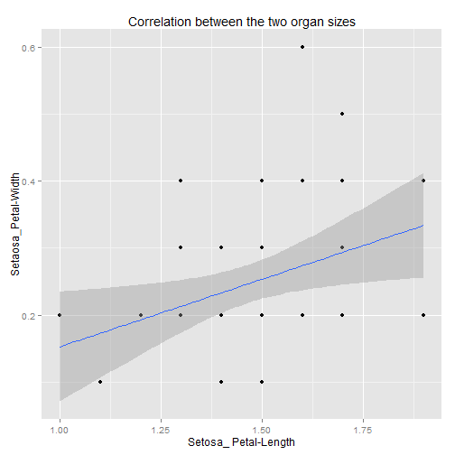

My First data project: App to explore iris dataset
========================================================
author: Raja Reddy
date: 21/April/2015
transition: concave
width : 1440
height : 900
Mission Objective : Explore iris data set
========================================================

Every data set needs to be carefully observed & explored before going to inferential statistics.   
  
-> Some of the exploratory tools that would help us are: 

- **"Summary"** of the data under study
- **"Frequency"** distribution of variables in data
- **"Relation"** between variables in data  
  
The same can be achieved using our app at http://duvvurum.shinyapps.io/plots3

Summary table of observations selected species
========================================================
For default selection i.e. **setosa** summary looks like:

```r
mydata = iris
setosa = subset(mydata, mydata$Species == "setosa")
z = summary(setosa)
head(z, 2)
```

```
  Sepal.Length      Sepal.Width       Petal.Length      Petal.Width     
 "Min.   :4.300  " "Min.   :2.300  " "Min.   :1.000  " "Min.   :0.100  "
 "1st Qu.:4.800  " "1st Qu.:3.200  " "1st Qu.:1.400  " "1st Qu.:0.200  "
       Species    
 "setosa    :50  "
 "versicolor: 0  "
```
"Multiple species selection is not allowed"  
  Use app at http://duvvurum.shinyapps.io/plots3

Explore distribution of measurements for each organ
========================================================
Normal distribution is preferred but not often observed.  
  
 
   
Select different organs and "explore" frequency distributions.
  
 Go to  http://duvvurum.shinyapps.io/plots3
Discover correlation between measurements for two organs
========================================================
Does the plant doing a perfet trading in using resources?  
Is there a relation between two two different organ sizes?
 
  
Hint : To see the perfect correlation select same organs from organ 1 and Organ 2  
Go to app at http://duvvurum.shinyapps.io/plots3
